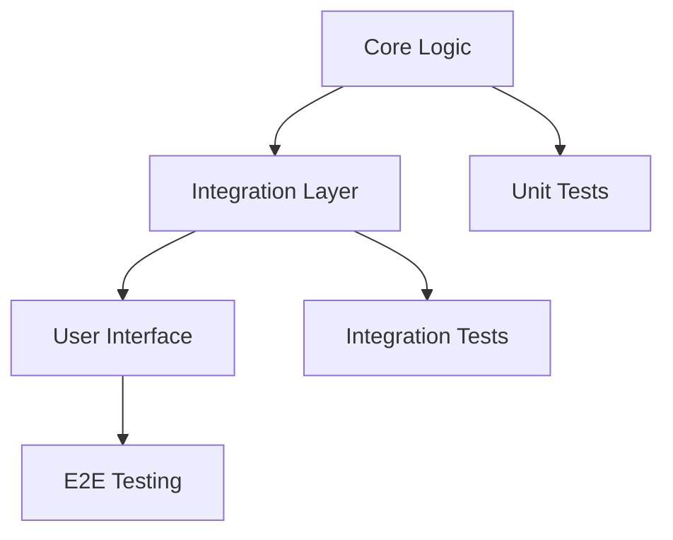

# PROGRAMMING TASK PLANNING TEMPLATE

**Version**: 1.0  
**Purpose**: Structured template for planning any programming task with mandatory quality assurance integration  
**Usage**: Copy and fill out this template before starting any programming task

---

## 📋 TASK OVERVIEW

### Basic Information
- **Task Title**: [Clear, descriptive title]
- **Task Type**: [Feature | Bug Fix | Refactor | Performance | Security | Technical Debt]
- **Priority**: [Critical | High | Medium | Low]
- **Estimated Complexity**: [1-5 scale, 1=trivial, 5=complex]
- **Estimated Time**: [Hours/Days]
- **Assigned Developer**: [Name]
- **Date Created**: [YYYY-MM-DD]

---

## 🎯 PHASE 1: REQUIREMENT ANALYSIS

### 1.1 Problem Statement Validation
**Complete this section before any technical planning:**

- **Problem Description**: 
  - [ ] What specific problem are we solving?
  - [ ] Why is this problem worth solving?
  - [ ] What happens if we don't solve it?

- **Stakeholder Impact**:
  - [ ] Who are the end users affected?
  - [ ] What business value does this provide?
  - [ ] Are there compliance/legal requirements?

- **Context & Background**:
  - [ ] What led to this requirement?
  - [ ] Are there related issues or dependencies?
  - [ ] What constraints exist (time, budget, technical)?

### 1.2 Scope Definition and Boundaries
**Define what IS and IS NOT included:**

**In Scope:**
- [ ] [Specific feature/fix item 1]
- [ ] [Specific feature/fix item 2]
- [ ] [Specific feature/fix item 3]

**Out of Scope:**
- [ ] [Explicitly excluded item 1]
- [ ] [Explicitly excluded item 2]
- [ ] [Explicitly excluded item 3]

**Boundary Conditions:**
- [ ] What edge cases must be handled?
- [ ] What edge cases are explicitly NOT handled?
- [ ] What integrations are required vs optional?

### 1.3 Success Criteria and Acceptance Tests
**Define MEASURABLE success criteria:**

**Functional Requirements:**
- [ ] [Requirement 1 with measurable criteria]
- [ ] [Requirement 2 with measurable criteria]
- [ ] [Requirement 3 with measurable criteria]

**Non-Functional Requirements:**
- [ ] Performance: [Specific metrics, e.g., "Response time < 200ms"]
- [ ] Scalability: [Specific limits, e.g., "Handle 1000 concurrent users"]
- [ ] Security: [Specific requirements, e.g., "All inputs validated"]
- [ ] Accessibility: [Specific standards, e.g., "WCAG 2.1 AA compliance"]

**Acceptance Test Scenarios:**
```gherkin
Scenario 1: [Happy path]
Given [initial state]
When [action performed]
Then [expected outcome]

Scenario 2: [Error case]
Given [error condition]
When [action performed]
Then [expected error handling]

Scenario 3: [Edge case]
Given [edge condition]
When [action performed]  
Then [expected behavior]
```

### 1.4 Risk Assessment and Mitigation Strategies
**Identify and plan for potential risks:**

| Risk | Probability | Impact | Mitigation Strategy | Contingency Plan |
|------|------------|--------|-------------------|------------------|
| [Risk 1] | [High/Med/Low] | [High/Med/Low] | [Prevention strategy] | [If risk occurs] |
| [Risk 2] | [High/Med/Low] | [High/Med/Low] | [Prevention strategy] | [If risk occurs] |
| [Risk 3] | [High/Med/Low] | [High/Med/Low] | [Prevention strategy] | [If risk occurs] |

---

## 🏗️ PHASE 2: TECHNICAL PLANNING

### 2.1 Architecture Design and Patterns
**Design before coding:**

- **Existing Architecture Review**:
  - [ ] How does this fit into current system architecture?
  - [ ] What existing patterns should be followed?
  - [ ] Are there architectural changes required?

- **Design Patterns to Apply**:
  - [ ] [Pattern 1: e.g., Repository pattern for data access]
  - [ ] [Pattern 2: e.g., Factory pattern for object creation]
  - [ ] [Pattern 3: e.g., Observer pattern for event handling]

- **SOLID Principles Check**:
  - [ ] Single Responsibility: Each class/function has one responsibility
  - [ ] Open/Closed: Open for extension, closed for modification
  - [ ] Liskov Substitution: Subtypes substitutable for base types
  - [ ] Interface Segregation: No forced dependency on unused interfaces
  - [ ] Dependency Inversion: Depend on abstractions, not concretions

### 2.2 Technology Stack Validation
**Verify compatibility with existing project:**

- **Existing Dependencies Check**:
  ```bash
  # Commands to check current stack
  cat package.json  # For Node.js projects
  cat requirements.txt  # For Python projects
  cat Cargo.toml  # For Rust projects
  ```

- **New Dependencies Required**:
  - [ ] [Dependency 1: Why needed, version constraints]
  - [ ] [Dependency 2: Why needed, version constraints]
  - [ ] [Dependency 3: Why needed, version constraints]

- **Compatibility Verification**:
  - [ ] Version compatibility with existing dependencies
  - [ ] License compatibility check
  - [ ] Security vulnerability assessment
  - [ ] Bundle size impact (for frontend projects)

### 2.3 Code Organization and File Structure
**Plan the code structure:**

**New Files to Create:**
```
src/
├── [component/feature]/
│   ├── index.ts                 # Public exports
│   ├── [Component].tsx          # Main implementation
│   ├── [Component].test.tsx     # Unit tests
│   ├── [Component].stories.tsx  # Storybook stories (if UI)
│   ├── types.ts                 # TypeScript interfaces
│   ├── utils.ts                 # Helper functions
│   └── README.md               # Component documentation
```

**Files to Modify:**
- [ ] [File 1: What changes and why]
- [ ] [File 2: What changes and why]
- [ ] [File 3: What changes and why]

**Import/Export Strategy:**
- [ ] How will new code be imported by other modules?
- [ ] What public APIs will be exposed?
- [ ] Are there breaking changes to existing APIs?

### 2.4 API Design and Contracts
**Define interfaces before implementation:**

**Public APIs (if applicable):**
```typescript
// Define TypeScript interfaces for all public APIs
interface [APIName] {
  [method]: (params: [ParamType]) => Promise<[ReturnType]>;
  // Include JSDoc comments
}
```

**Data Models:**
```typescript
// Define all data structures
interface [ModelName] {
  id: string;
  [property]: [Type];
  // Validate all properties have proper types
}
```

**Error Handling Contracts:**
```typescript
// Define error types and handling
type [ErrorType] = {
  code: string;
  message: string;
  details?: unknown;
};
```

---

## 🔍 PHASE 3: QUALITY ASSURANCE PLANNING

### 3.1 Test Coverage Strategy
**Plan testing BEFORE implementation:**

#### Unit Test Planning
**Functions/Methods to Test:**
- [ ] [Function 1: Happy path, error cases, edge cases]
- [ ] [Function 2: Happy path, error cases, edge cases]
- [ ] [Function 3: Happy path, error cases, edge cases]

**Unit Test Coverage Targets:**
- [ ] **Minimum**: 80% line coverage
- [ ] **Target**: 90% line coverage
- [ ] **Critical paths**: 100% coverage

**Unit Test Structure:**
```javascript
describe('[ComponentName]', () => {
  describe('[methodName]', () => {
    it('should handle happy path', () => {
      // Test implementation
    });
    
    it('should handle error case: [specific error]', () => {
      // Error handling test
    });
    
    it('should handle edge case: [specific edge case]', () => {
      // Edge case test
    });
  });
});
```

#### Integration Test Requirements
**Integration Points to Test:**
- [ ] [API endpoint + database integration]
- [ ] [Component + external service integration]
- [ ] [Module A + Module B integration]

**Integration Test Scenarios:**
- [ ] [Scenario 1: Cross-module data flow]
- [ ] [Scenario 2: External service interaction]
- [ ] [Scenario 3: Database transaction handling]

#### E2E Test Scenarios
**Critical User Journeys:**
- [ ] [Journey 1: Primary user workflow]
- [ ] [Journey 2: Error recovery workflow]
- [ ] [Journey 3: Edge case user workflow]

**E2E Test Tools:**
- [ ] Playwright (for web applications)
- [ ] Cypress (alternative for web)
- [ ] API testing tools (for backend)

### 3.2 Type Safety Planning
**TypeScript/Type Safety Strategy:**

#### Interface Definitions
```typescript
// Define all interfaces BEFORE implementation
interface [ComponentProps] {
  [prop1]: [Type1];
  [prop2]?: [OptionalType2];  // Mark optional props clearly
  [prop3]: [Type3] | [Type4]; // Union types where applicable
}

interface [StateType] {
  [stateProperty]: [Type];
  // Define all state shape
}

interface [APIResponse] {
  data: [DataType];
  error?: [ErrorType];
  meta: [MetaType];
}
```

#### Type Validation Strategies
- [ ] **Runtime validation**: Use Zod/Joi for API inputs
- [ ] **Compile-time validation**: Strict TypeScript config
- [ ] **Type guards**: Implement type narrowing functions
- [ ] **Generic types**: Use generics for reusable components

#### Generic Type Considerations
```typescript
// Plan generic types for reusability
interface [GenericInterface]<T> {
  data: T;
  loading: boolean;
  error: string | null;
}

// Consider constraint requirements
interface [ConstrainedGeneric]<T extends [BaseType]> {
  // Implementation
}
```

### 3.3 Documentation Planning
**Documentation requirements BEFORE coding:**

#### Code Documentation (TSDoc/Docstrings)
**Functions requiring documentation:**
- [ ] All public functions
- [ ] Complex private functions
- [ ] All exported types/interfaces

**Documentation Template:**
```typescript
/**
 * Brief description of what the function does
 * 
 * @param param1 - Description of param1
 * @param param2 - Description of param2
 * @returns Description of return value
 * 
 * @example
 * ```typescript
 * const result = functionName(value1, value2);
 * console.log(result); // Expected output
 * ```
 * 
 * @throws {ErrorType} When this specific error occurs
 * @since version 1.0.0
 */
```

#### README Updates
**Documentation sections to update:**
- [ ] Installation instructions (if dependencies added)
- [ ] Usage examples
- [ ] API documentation
- [ ] Configuration options
- [ ] Troubleshooting guide

#### API Documentation
**If creating/modifying APIs:**
- [ ] OpenAPI/Swagger specification
- [ ] Request/response examples
- [ ] Error code documentation
- [ ] Rate limiting information
- [ ] Authentication requirements

#### Architecture Decision Records (ADRs)
**Create ADR if:**
- [ ] Significant architectural decision made
- [ ] Technology choice with alternatives considered
- [ ] Design pattern selection with trade-offs
- [ ] Breaking change introduced

**ADR Template:**
```markdown
# ADR-[number]: [Decision Title]

## Status
[Proposed | Accepted | Deprecated | Superseded]

## Context
[Describe the forces at play, including technological, political, social, and project local]

## Decision
[State the architecture decision and full justification]

## Consequences
[Describe the resulting context, after applying the decision]
```

---

## 🚀 PHASE 4: IMPLEMENTATION PLANNING

### 4.1 Task Breakdown
**Break down into small, testable units:**

#### Implementation Order
1. **Phase 1: Core Logic** (No UI, minimal dependencies)
   - [ ] [Task 1.1: Core function implementation]
   - [ ] [Task 1.2: Unit tests for core logic]
   - [ ] [Task 1.3: Type definitions]

2. **Phase 2: Integration Layer**
   - [ ] [Task 2.1: API integration]
   - [ ] [Task 2.2: Integration tests]
   - [ ] [Task 2.3: Error handling]

3. **Phase 3: User Interface** (if applicable)
   - [ ] [Task 3.1: Component implementation]
   - [ ] [Task 3.2: Component tests]
   - [ ] [Task 3.3: Storybook stories]

4. **Phase 4: End-to-End**
   - [ ] [Task 4.1: E2E test implementation]
   - [ ] [Task 4.2: Performance testing]
   - [ ] [Task 4.3: Documentation]

#### Dependencies Between Tasks


### 4.2 Feature Branching Strategy
**Git workflow planning:**

- **Branch Naming**: `feature/[task-name]` or `fix/[bug-name]`
- **Base Branch**: [main | develop | specific feature branch]
- **Merge Strategy**: [Squash | Merge commit | Rebase]

**Commit Message Format:**
```
type(scope): brief description

Longer description if needed

- Change 1
- Change 2
- Change 3
```

### 4.3 Code Review Checkpoints
**Define review points:**

- [ ] **Checkpoint 1**: Core logic + unit tests
- [ ] **Checkpoint 2**: Integration layer + integration tests
- [ ] **Checkpoint 3**: UI components + component tests
- [ ] **Checkpoint 4**: E2E tests + documentation

**Review Criteria Checklist:**
- [ ] Code follows project style guidelines
- [ ] All new code has tests
- [ ] Documentation is updated
- [ ] No console.log/debug statements
- [ ] Error handling is appropriate
- [ ] Performance considerations addressed
- [ ] Security best practices followed

---

## ✅ PHASE 5: VALIDATION & DEPLOYMENT PLANNING

### 5.1 Testing Execution Plan
**Test execution order:**

1. **Unit Tests** (first, fastest feedback)
   ```bash
   npm run test:unit
   # or
   pytest tests/unit/
   ```

2. **Integration Tests** (after unit tests pass)
   ```bash
   npm run test:integration
   # or
   pytest tests/integration/
   ```

3. **E2E Tests** (after integration tests pass)
   ```bash
   npm run test:e2e
   # or
   playwright test
   ```

4. **Manual Testing Scenarios**
   - [ ] [Manual test scenario 1]
   - [ ] [Manual test scenario 2]
   - [ ] [Manual test scenario 3]

### 5.2 Performance Benchmarking
**If performance is a concern:**

- **Metrics to Measure**:
  - [ ] Response time: [target < Xms]
  - [ ] Memory usage: [target < XMB]
  - [ ] CPU usage: [target < X%]
  - [ ] Bundle size: [target < XkB] (frontend)

- **Performance Testing Tools**:
  - [ ] Lighthouse (for web performance)
  - [ ] Artillery/k6 (for load testing)
  - [ ] Memory profilers
  - [ ] CPU profilers

- **Benchmarking Plan**:
  ```bash
  # Commands to run performance tests
  npm run perf:test
  npm run bundle:analyze
  ```

### 5.3 Security Validation
**Security checklist:**

- [ ] **Input Validation**: All user inputs validated
- [ ] **Authentication**: Proper auth checks in place
- [ ] **Authorization**: Correct permission checks
- [ ] **Data Sanitization**: XSS prevention measures
- [ ] **SQL Injection**: Parameterized queries used
- [ ] **Secrets Management**: No hardcoded secrets
- [ ] **HTTPS**: All communications encrypted
- [ ] **Dependencies**: Security audit passed

**Security Testing:**
```bash
npm audit
# or
safety check  # Python
```

### 5.4 Deployment and Rollback Strategy
**Deployment planning:**

#### Pre-deployment Checklist
- [ ] All tests passing
- [ ] Code reviewed and approved
- [ ] Documentation updated
- [ ] Security scan passed
- [ ] Performance benchmarks met
- [ ] Database migrations tested (if applicable)

#### Deployment Steps
1. **Staging Deployment**
   - [ ] Deploy to staging environment
   - [ ] Run smoke tests
   - [ ] Validate with stakeholders

2. **Production Deployment**
   - [ ] Deploy during maintenance window
   - [ ] Monitor error rates
   - [ ] Validate core functionality

#### Rollback Plan
- **Rollback Triggers**:
  - [ ] Error rate > X%
  - [ ] Response time > Xms
  - [ ] Core functionality broken

- **Rollback Steps**:
  1. [ ] Revert application code
  2. [ ] Revert database migrations (if applicable)
  3. [ ] Clear caches
  4. [ ] Validate rollback success

---

## 📊 COMPLETION CRITERIA

### Final Validation Checklist
**Before marking task complete:**

- [ ] **Functionality**: All acceptance criteria met
- [ ] **Testing**: All tests passing with required coverage
- [ ] **Types**: No TypeScript errors, all APIs typed
- [ ] **Documentation**: All documentation updated
- [ ] **Performance**: Performance benchmarks met
- [ ] **Security**: Security validation passed
- [ ] **Code Review**: All review feedback addressed
- [ ] **Deployment**: Successfully deployed and validated

### Quality Gates
**Task cannot be marked complete unless:**

- [ ] **Test Coverage**: ≥80% (or project-specific minimum)
- [ ] **Type Coverage**: 100% (no `any` types in new code)
- [ ] **Documentation Coverage**: All public APIs documented
- [ ] **Performance**: Meets or exceeds performance requirements
- [ ] **Security**: Passes all security checks
- [ ] **Review**: Approved by at least one reviewer

---

## 📝 NOTES & CONSIDERATIONS

### Additional Notes
[Space for any additional project-specific considerations, special requirements, or notes that don't fit in other sections]

### Lessons Learned
[To be filled out after completion - what went well, what could be improved for next time]

---

## 🔧 TEMPLATES & DECISION TREES

### Task Type Decision Tree
```
Is this a...
├── New Feature?
│   ├── UI Component? → Use Component Planning Template
│   ├── API Endpoint? → Use API Planning Template
│   └── Business Logic? → Use Logic Planning Template
├── Bug Fix?
│   ├── Frontend Bug? → Focus on UI testing + E2E
│   ├── Backend Bug? → Focus on unit + integration tests
│   └── Integration Bug? → Focus on integration + E2E tests
├── Refactor?
│   ├── Performance? → Include benchmarking
│   ├── Code Quality? → Focus on maintainability metrics
│   └── Architecture? → Require ADR
└── Technical Debt?
    ├── Add Tests? → Focus on coverage improvement
    ├── Update Dependencies? → Focus on compatibility testing
    └── Improve Documentation? → Focus on doc completeness
```

### Test Planning Decision Tree
```
What type of code change?
├── Pure Function/Logic?
│   └── Unit Tests (happy path + edge cases + error handling)
├── API Endpoint?
│   ├── Unit Tests (business logic)
│   ├── Integration Tests (database + external services)
│   └── API Tests (request/response validation)
├── UI Component?
│   ├── Component Tests (rendering + interactions)
│   ├── Visual Tests (Storybook/screenshot testing)
│   └── Accessibility Tests (a11y validation)
└── Full Feature?
    ├── Unit Tests (all individual functions)
    ├── Integration Tests (component interactions)
    └── E2E Tests (user journey validation)
```

### Documentation Requirements Matrix

| Code Type | TSDoc/Docstring | README Update | API Docs | ADR | Examples |
|-----------|----------------|---------------|----------|-----|----------|
| Public Function | ✅ Required | ❌ No | ❌ No | ❌ No | ✅ Required |
| Public API | ✅ Required | ✅ Required | ✅ Required | ❌ No | ✅ Required |
| Component | ✅ Required | ❌ No | ❌ No | ❌ No | ✅ Required (Storybook) |
| Architecture Change | ✅ Required | ✅ Required | ❌ No | ✅ Required | ✅ Required |
| Breaking Change | ✅ Required | ✅ Required | ✅ Required | ✅ Required | ✅ Required |

---

**Template Version**: 1.0  
**Last Updated**: [Date]  
**Next Review**: [Date + 3 months]